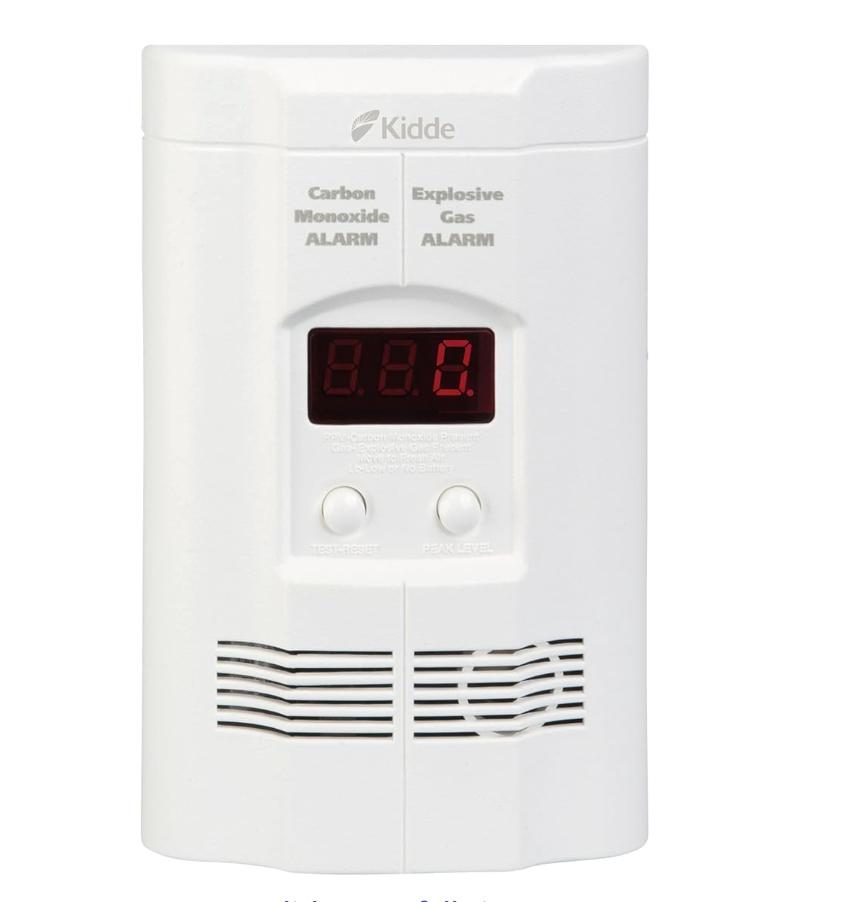

Our mission is to design and deliver a practical, market-relevant embedded power systems project that balances commercial viability with environmental growth for all people. By focusing on achievable scope, profitability, and real-world need, we aim to sharpen our skills in embedded systems, coding, sensors, and solid-state electronics—building both technical expertise and entrepreneurial insight while completing a product that genuinely serves its users.

## Voice of the Customer Benchmarking

### Search #1

**Keywords:** "Environmental hazard detector"

**Search Results Link:** [https://www.amazon.com/s?k=environmental%2Bhazard%2Bdetector&ref=nb_sb_noss](https://www.amazon.com/s?k=environmental%2Bhazard%2Bdetector&ref=nb_sb_noss)

### Selected Products

#### 1. [Kidde multi hazard detector](https://a.co/d/in1cRGL) < (link to the product)

**(include a picture)**

* Price: $53.99

* Vendor: Amazon

* Description: The product can detect carbon conoxide, propane, natural, nethane, & explosive gas Alarm. The product can be plugged-in to the all with 9-Volt Battery Backup. Also, it includes digital LED Display. Peak Level Memory records the last time carbon monoxide was detected or when the unit was tested. The Smart-Hush button silences the unit for approximately 8 minutes, which is helpful when this smoke detector carbon monoxide detector combo sounds from things like routine cooking or shower steam.
##### Positive Comments

| Voice of the Customer                                                                                                                                                                  | Restated Customer Need                                                              |
| -------------------------------------------------------------------------------------------------------------------------------------------------------------------------------------- | ----------------------------------------------------------------------------------- |
| "How much is your home worth? How much is YOUR LIFE, and the lives of those you love, really worth? This dual-function unit would be worth the protection it provides at DOUBLE the price. It is SO simple to use, yet so much better than cheaper units. It will show a reading of gas on its continuous display, BEFORE the amount will set off the alarm! This make it superior to any kind of alarm I have ever purchased before. Do you use natural gas for cooking or heating in your home? Then why are you still just sitting there reading? You NEED this alarm. Stop thinking of the price difference, for crying out loud. Your home AND your life are both PRICELESS. Be smart and responsible. BUY THIS UNIT NOW!
" | 1.  The product is very important for health and worth buying because life is priceless compared to product (explicit)                              |
| Very flexible placement options. I bought this item to warn me about elevated propane levels near the gas dryer in my basement. As per the instructions, I placed the unit on the floor. To test it, I depressed the pin of a small Coleman propane gas cylinder that I held near the sensor. After a short while the sensor displayed “gas” on its screen and let out an alarm that could wake the dead. I feel protected.
                                                                                                                                                                                        | 2.  Customer can feel protected and have more safety (explicit) |
| The Kidde Carbon Monoxide and Explosive Gas Detector is an absolute must-have for every household. Safety is non-negotiable, and this device provides peace of mind like no other.

Right out of the box, setup is a breeze—just plug it in, and you’re protected. The digital display is clear and easy to read, providing real-time updates on CO and gas levels. What truly sets this apart is the dual detection for both carbon monoxide and explosive gases, ensuring comprehensive coverage in one compact device.

During testing (using safe methods), the alarm proved to be both sensitive and reliable. The loud, piercing sound is impossible to miss, making it effective in alerting you and your family in case of danger. It’s reassuring to know this device is constantly monitoring, even while we sleep.

I also appreciate the sleek, unobtrusive design—it blends seamlessly into any room while remaining highly functional. With Kidde’s reputation for quality and reliability, I feel confident that this detector is working around the clock to protect my home and loved ones.

Safety, simplicity, and top-notch performance—this detector delivers it all. Don’t wait until it’s too late—invest in this lifesaver today. Highly recommended for every home, apartment, or office!                                                                                                                                                                                        | 3.  Recommended for everyone for everyhome (latent)                               |

##### Negative Comments

| Voice of the Customer                                                                                                                                                                                                                                                                                                                                                                                | Restated Customer Need                                  |
| ---------------------------------------------------------------------------------------------------------------------------------------------------------------------------------------------------------------------------------------------------------------------------------------------------------------------------------------------------------------------------------------------------- | ------------------------------------------------------- |
| "This product is an absolute joke. I don’t know where Kidde is sourcing these, but mine reached its end of life in less than one week. That’s right – a brand-new carbon monoxide and gas alarm already declared itself useless after only a few days of use. For something that’s supposed to protect lives, this level of quality is completely unacceptable. I expected reliability and peace of mind, not a defective unit that dies right out of the box. Total waste of money and trust. Save yourself the frustration and buy literally any other brand. This one is worthless." | 1.  The product is not at good quality. (explicit)                       |
| "I had an all home generator installed which included our propane company to come perform a leak check. They found a significant leak in my home and took measures to repair. They recommended I purchase a detector -- I informed them I had three (3) in my home; one on each floor. They gasped. I showed them where the main floor detector was plugged in -- again gasped. The service employee said the one of the three should absolutely have picked up the leak as one detector was right above the leak and the basement detector was right below. Never did either go off and I check the readout's constantly as they are in my sight when walking by. Not impressed . . . at all.
"                                                                                                                                                                                                                                                                                                                                                                                                     | 2.  The measurements of the product are not working.(latent) |
| "Complete junk. Why would it need a battery when its plugged in? It keeps popping up LB when its plugged in.
The battery cable isn't even secured and has a inch or more of wire out so I can't seat it correctly, therefore the battery can't even stay in or be safely secured."                                                                                                                                                                                                                                                                                                                                                                                                   | 3.  The product battery is not secured well enough (explicit)           |

#### 2. Water Quality Testers

### Search #2

water quality tester

**Search Results Link:** <add your link here>
[https://www.amazon.com/s?k=water+quality+tester&crid=3W5YQF5MCB5L&sprefix=water+quality+tester%2Caps%2C128](https://www.amazon.com/s?k=water+quality+tester&crid=3W5YQF5MCB5L&sprefix=water+quality+tester%2Caps%2C128)

### [MEXYBE 4 in 1 Tds Meter Digital Water Tester](https://www.amazon.com/All-New-Meter-Digital-Water-Tester/dp/B0CTHWS8GX?crid=3W5YQF5MCB5L&dib=eyJ2IjoiMSJ9.C-HI3ll8hekZ5ZobF53ztXwuPDgwzU8Cj_w3pNx_1yZPXFxRz4g3MypQGESxtmu6p5U_sVgxvacb_7Vl23WSO6ReKi4_c3MkxwL8qD7lym_RtFSc1WEgebKO2GeOv_hYK1b31r41hzkQmi-5-WKExyNslHakWvAMU8SsWVR3wyT9Qef30qyIcHobmRU6CcVpdNRPAMBN6WrdseZ4_r3c-EkEfg9HdSaz315dLUtzMRY.Xtcx4Wdj2qjD0VZeBnHrdE0Xg7g26fZYxIezjyNxppQ&dib_tag=se&keywords=water%2Bquality%2Btester&qid=1757993454&sprefix=water%2Bquality%2Btester%2Caps%2C128&sr=8-3&th=1)

* Price: $8.54

* Vendor: Amazon

* Description: A handheld water tester device with an LCD unit and green/red backlight to indicate contamination levels. Two titanium probes are used as the main sensing elements, claiming to detect TDS (total dissolved solids), electrical conductivity and temperature. 

##### Positive Comments

| Voice of the Customer                                                                                                                                                                  | Restated Customer Need                                                              |
| -------------------------------------------------------------------------------------------------------------------------------------------------------------------------------------- | ----------------------------------------------------------------------------------- |
| "Wanted mom to drink my filtered water I get from my rain barrel and clean. Said store bought is better. I got several layers of filters to clean it more and she said no, but dad loved it. Then got a UV-C light to get 100% comfort on disinfection. Mom still said no.

So got this to prove the cleanliness of the water and checked a bottle of water and got 34. Wells within 0-50. So I tried my water at various stages of clean. After the initial screens and uv-c light. It’s already 14-16. Add the extra filters and a pass through a brita filter and down to 11. Mom still not convinced hehe. Even aunts distilled water was only down to 7. So thought “let’s check the well water too!” Big mistake as the screen turned dark red as it displayed 1760 and basically told me to run.

So really cool and seems to work really well, didn’t even realize it had a temperature control feature, but the readability of the screen and size of the device are really nice and helped give me more comfort in my drinking water.
" | 1.  The results aligning with the user's intuition gives them faith in the accuracy (explicit)                              |
|                                                                                                                                                                                        | 2.  The device's size makes it convenient (explicit) |
|                                                                                                                                                                                        | 3.  The colour LCD warning is appreciated for ease of measurement. (latent)                               |

##### Negative Comments

| Voice of the Customer                                                                                                                                                                                                                                                                                                                                                                                | Restated Customer Need                                  |
| ---------------------------------------------------------------------------------------------------------------------------------------------------------------------------------------------------------------------------------------------------------------------------------------------------------------------------------------------------------------------------------------------------- | ------------------------------------------------------- |
| "So I purchased this for aquarium use. You get quick readings when testing the TDS. I tested my tap water which came in at 30-34 ppm, which is the range I expected since I know for a fact that San Francisco water is known for good clean tap water and always drink it. I then wanted to test the temperature readings and it didn’t work at all. Cold water or hot water, it just gave me one reading. It only fluctuated once by one or two degrees from cold water to hot water. If it can’t get a simple temperature reading then I question how reliable the TDS reading actually is. I’ll probably buy a different meter to double check the accuracy because for now I can’t really trust it.
" | 1.  The accuracy of the reading is unknown, so it is untrustworthy. (explicit)                       |
|                                                                                                                                                                                                                                                                                                                                                                                                      | 2.  The temperature sensor is inaccurate, leading to doubts about the machine's overall accuracy. (explicit) |
|                                                                                                                                                                                                                                                                                                                                                                                                      | 3.  The user would like some way of calibrating or ensuring accuracy of the unit (latent)           |

#### 3. Air Quality Testers

### Search #3

air quality tester

**Search Results Link:** <add your link here>
[https://www.amazon.com/s?k=air+quality+monitor&crid=3JKVTP8P7XGHN&sprefix=air+quality+monitor%2Caps%2C1518](https://www.amazon.com/s?k=air+quality+monitor&crid=3JKVTP8P7XGHN&sprefix=air+quality+monitor%2Caps%2C151)

### [Airthings 2960 View Plus](https://www.amazon.com/Airthings-2960-View-Plus-Humidity/dp/B097YW5Q72?crid=3JKVTP8P7XGHN&dib=eyJ2IjoiMSJ9.HDz4e7D-xGpiZAI9N2PvbIMh3bHN27QhrdQOHfqU-bTGQTG-3uxeaJ8aaXy_CE5j3zOGyNOKZAId-nRhTEN3m8QvYw9JBjzZaFlZk1MntDLKg50idK1R1vueyFflHOsKCYmIjpZdcuUm2pKlMZ3kcHsp8V5unaWSgLUDLgngZs_DK8JIn3a13_37ASJH4coynEQitQPAAPdWa0waro7NNicSRc6P_toeNPgVwhuyea0.R23oyBI7zrYQ2U8sf3iFC9EuXZkGcco9x7alUPIqfb0&dib_tag=se&keywords=air%2Bquality%2Bmonitor&qid=1757996564&sprefix=air%2Bquality%2Bmonitor%2Caps%2C151&sr=8-16&th=1)

* Price: $329.99

* Vendor: Amazon

* Description: A fixed home air quality monitoring device with a small screen and mobile phone connectivity for logging and detailed output. Measures radon, C02, VOCs, humidity, temperature and pressure.

##### Positive Comments

| Voice of the Customer                                                                                                                                                                  | Restated Customer Need                                                              |
| -------------------------------------------------------------------------------------------------------------------------------------------------------------------------------------- | ----------------------------------------------------------------------------------- |
| "I  have had this unit for almost 2 years now, I will buy another. It literally saved my life! If you work from home, like I do, then you need this unit or something like it. I had Radon levels above 7pCi/L and had been living with it without knowing it, for almost 3 years. For those that don't know, Radon is a radioactive breakdown of uranium, thorium, or radium in rocks, soil, and groundwater. The CDC and EPA claim that levels above 4pCi/L are considered highly toxic and proper mitigation should be taken to reduce the levels. This is why Radon mitigation systems are installed in nearly every home across the United States.
If you don't know, educate yourself about Radon and understand that radon causes over 21,000 lung cancer deaths in the United States each year and 2,900 of those deaths are people that have never smoked a day in their lives! For me, every now and then, I would cough and a small spat of blood would sometimes appear and i could never figure out why...
Now, do you NEED this system?
- Absolutely not, there are plenty of radon detectors out there and they are pretty cheap
Why do I recommend this system and why did I choose it?
- Historical Data: This bad boy tracks all of your air quality metrics over time. This is extremely important when you want to understand cause and effect in anything in life. Many of the "bad reviews" talk about how some of the metrics displayed are inaccurate when compared to another device that specializes in one or many of the metrics this unit does display. Accurate comparisons only matter when comparing against a controlled environment and are purely for the sake of argument. This is important to understand because no unit needs to be 100% accurate, it just needs to be accurate to itself so that when you make a change, you can properly see that the change is affecting the metrics in a way that makes sense for what you meant to accomplish.
For example, I had high radon (the value of the metric didn't matter other than the fact that it is higher than 0... it's radioactivity, is anything above 0 TRULY acceptable?) When I installed my radon mitigation system, I could watch my Radon levels drop tremendously over time, which proved that my radon mitigation system was actually working as expected! Also, I haven't had any spots of blood appear when I cough... I call this a success.
- Dashboard: Airthings has a nice application and semi-customizable dashboard which makes viewing really easy to do, and from anywhere in the world. When my pets are home while the family is away, I can notify my neighbor to open a window to let some fresh air in, while we're away.
- Alerts: Always cool to have alerts so you don't even need to "monitor" the metrics. Fun fact, CO2 builds up pretty rapidly in a well-sealed home. When you go through insulation techniques to seal off cracks and crevices to improve your HVAC efficiency in the thermal zone, it is easy to forget that CO2 has no easy escape. Needless to say, this little guy alerted my phone and I was able to crack a window and keep my family safe. I later installed a fresh air intake on my HVAC system and again, could watch the metrics historically, as they fell to a more than acceptable range, yet again proving that my air intake installation was actually doing its job.
I hope this helps anyone looking to decide on this purchase. It has been an absolute godsend to have in our home and I didn't even get into some of the other things it helped me solve that had been plaguing us.
" | 1.  The device's warning improved the user's health by alerting them to install a mitigation system(explicit)                              |
|                                                                                                                                                                                        | 2.  The device's logging capabilities allowed the user to test the efficacy of their mitigation system (explicit) |
|                                                                                                                                                                                        | 3.  The multi-contaminant nature of the system was helpful at dealing with a semi-common residential case. (explicit)                               |

##### Negative Comments

| Voice of the Customer                                                                                                                                                                                                                                                                                                                                                                                | Restated Customer Need                                  |
| ---------------------------------------------------------------------------------------------------------------------------------------------------------------------------------------------------------------------------------------------------------------------------------------------------------------------------------------------------------------------------------------------------- | ------------------------------------------------------- |
| "1. The app can be more optimized for the enhance. For example, the app does not show the remaining battery life which is on the web dashboard.
2. It maybe a good idea to add “identifying sensor” to the app. If consumer bought multiple units with the same looks, they can easily mixed up the sensors. It is difficult to tell which is which. For instance, the “find the sensor” may trigger the one to blink signal light. It is the feature I saw on my wifi mesh equipments.
3. It works without hub from my understanding. However, to get real time data, it requires a Airthings hub. I have a wave view plus at ground level, therefore, it was not an issue to me.
" | 1.  The app does not have good battery readout. (explicit)                       |
|                                                                                                                                                                                                                                                                                                                                                                                                      | 2.  The app is not well optimized for multi-sensor applications. (explicit) |
|                                                                                                                                                                                                                                                                                                                                                                                                      | 3.  The need for a hub forces the user into a vendor-lock-in ecosystem (latent)           |

#### 3. Water pH Detectors

### Search #4

ph detector for drinking water

**Search Results Link:** <add your link here>
[https://www.amazon.com/2025-All-New-Meter-Water-Certification/](https://www.amazon.com/2025-All-New-Meter-Water-Certification/dp/B0F92GK3CT/ref=sr_1_2_sspa?adgrpid=1344703288250045&dib=eyJ2IjoiMSJ9.n0NOUtKAUb4eXlaLxJRc4lsOiirQBQtQ81VvhQy9WRq1SymizoHtzxl3xXEiaKAMoN2fZGGw-smfX_C7qTi2augE6KntESPWbaS_ouJHIlPmQGGLiNFrHM5dADQgDiVZ1SKfHZGZez1fAXd3oMxqKtt7PAL7Pxa7ZnIKeDNKtx0Pm9Fz3zKnDyWgFGhVf8MUEowNH8xK6CifPUgnve9VTjEkgY4fb8uCycVO9pu3bs8.Zmw2Y3YcilBA6v8uMxzmERTJE7B45Kebt3zqY8DXH9Y&dib_tag=se&hvadid=84044196064353&hvbmt=be&hvdev=c&hvlocphy=78088&hvnetw=o&hvqmt=e&hvtargid=kwd-84044307708264%3Aloc-190&hydadcr=20192_13329694&keywords=ph%2Bmeter%2Bdrinking%2Bwater&mcid=f18f18263c063419af12eefbe9eb256e&qid=1757998515&sr=8-2-spons&sp_csd=d2lkZ2V0TmFtZT1zcF9hdGY&th=1)

* Price: $8.99

* Vendor: Amazon

* Description: A pH detector for various pools of water, such as drinking water, hydroponics, aquariums and more. Accurate with a 0.01 precision and has UL certification. Also comes with 3 pH calibration powders.

##### Positive Comments

| Voice of the Customer                                                                                                                                                                  | Restated Customer Need                                                              |
| "This PH tester seems to be working well ! It quickly measures the PH within seconds. The read out is fast and accurate as I used another brand as well . I had it tested and it is completely accurate. I like the small size and portable one ! Good value at this low a price" | Users need a quick and accurate measurement of pH |
|

##### Negative Comments
| Feedback (from reviews) | Restated User Need | Explicit / Latent |
|---|---|---|
|Feedback 1 here|User need here|Ex/Latent|
|Feedback 1 here|User need here|Ex/Latent|
|Feedback 1 here|User need here|Ex/Latent|

| Voice of the Customer                                                                                                                                                                                                                                                                                                                                                                                | Restated Customer Need                                  |
| "It works but It is soooooooo slooooow" | Users need a quick read-out of pH measurements |
|

#### 5. 
environmental hazard monitoring system

**Search Results Link:** <add your link here>
[environmental hazard monitoring system](https://www.amazon.com/s?k=environmental+hazard+monitoring+system)

### [9-in-1 Professional Indoor Air Quality Monitor Portable PM2.5/PM10/CO2, Temperature, Formaldehyde Detector, Humidity TVOC,Time Display Air Quality Tester - Confined Space Clean Air Monitor (Green)](https://www.amazon.com/Professional-Portable-Temperature-Formaldehyde-Detector/dp/B0DMSMR24Q/ref=sr_1_1_sspa?sr=8-1-spons&sp_csd=d2lkZ2V0TmFtZT1zcF9hdGY)

* Price: $139.99

* Vendor: Amazon

* Description: This 9-in-1 indoor air quality monitor detects PM 1.0, PM2.5, PM10, CO2, temperature, formaldehyde, humidity, TVOC, and time. It features a high-definition color screen for easy reading and is portable with a built-in rechargeable battery. The device is suitable for various spaces like grow rooms, offices, and cars.

#### Positives
| Feedback (from reviews) | Restated User Need | Explicit / Latent |
|---|---|---|
| “Easy to use / setup is simple; values are clear; color-coded GOOD/BAD indicator.” | The device requires minimal setup and provides clear, at-a-glance status (GOOD/BAD, color coding). | Explicit |
| “Measures PM2.5, PM10, CO₂, HCHO, TVOC, temperature, humidity in real time; beeps/red warning during events (cooking, close breathing).” | The device monitors multiple pollutants with real-time alerts for unsafe levels. | Explicit |
| “Portable; usable on battery; convenient to move room-to-room or wall-mount.” | The device supports flexible placement with battery operation and mounting options. | Explicit |

#### Negatives
| Feedback (from reviews) | Restated User Need | Explicit / Latent |
|---|---|---|
| “Accuracy issues (e.g., temperature off by ~15°; humidity ‘way inaccurate’), loss of confidence.” | Measurements must remain within acceptable tolerances across all sensors to maintain trust. | Explicit |
| “Takes a few minutes to show stable readings.” | The device should have a short warm-up/stabilization time before readings are reliable. | Latent |
| “Battery doesn’t last long for all-day unplugged use (had to keep it plugged).” | The device should provide longer unplugged runtime without sacrificing performance. | Explicit |

## Organized Need Statements

### First Placement

### Grouped with categories

### Ranked

## Compiled list of user Needs

1. The device will have accurate measurements
1. The device's measurements can be calibrated or validated in some way
1. The device can be easy to read without much training on the values reported
100. The device is long-lasting, especially with regards to battery life.

