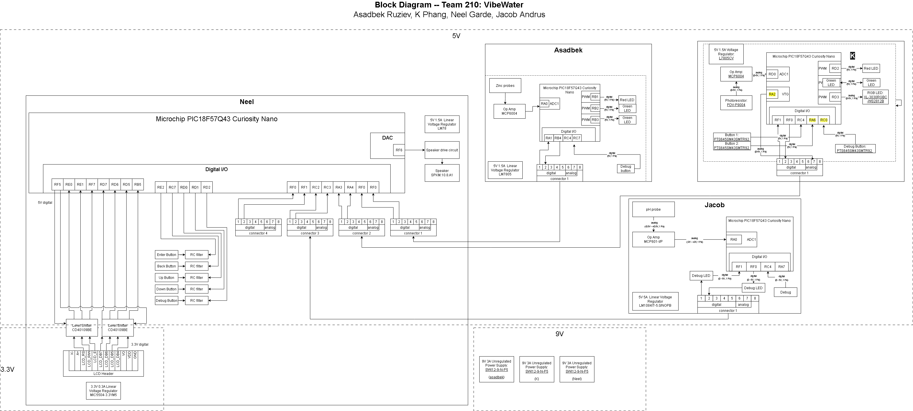

title: Group Block Diagram

**Figure 1:** Block Diagram

For individual subsystem/member block diagrams, please visit the individual datasheets.

## Design Process

To design our block diagram, we focused on maximizing the independancy of our subsystems. We also focused on minimizing power rails, leading to all our systems outside the LCD and the power supplies operating within the 5V rail. We had to incorporate level shifters to supply logic to to our 3.3V LCD display, which necessitated a 3.3V power supply as well. We used a simple 2-lane header for UART data transmission between our boards to minimize the amount of data-carrying wires, which improves the reliability of our subsystem. 

## Requirements Conformity

Our team block diagram meets both our imposed requirements and the requirments of the project by providing a hub-and-spoke method for connection, a standard 9V unregulated power supply, 5V operation of the Curiosity Nano boards, 3 sensors and an actuator, all driven by custom circuitry and analog ICs, and debouncing our buttons. We meet our goals of testing water with the given 3 testing methods, as well as proving an intuitive and easy user interface. 
