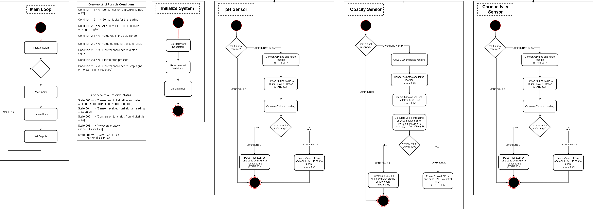

## Introduction
Our team utilizes a hub-and-spoke control/communication method for our project's software, with one subsystem (user input) acting as a motherboard to connect the other 3 sensor boards. The headers can be arbitrarily chosen, as the controller is not aware of the nature of the sensor, and communications are standardized across sensor boards. Simple 2-wire asynchronous digital signaling is used for communication between our boards, where the controller board can set it's own TX pin to signal to 

## Images

**Figure 1:** Sensors state diagram

Source file available to [download](software_soft_final.drawio)

**Figure 2:** Controller activity diagram

Source file available to [download](ctrl_soft_final.drawio)

## Design Process

Originally our software design was intended to use an interrupt driven layout with UART communications. However, due to time constraints and difficulties with the MPLAB IDE and compiler, we decided to switch our software over to a simple linear/monolithic system that used asynchronous digital high/low pins to transmit single-bit signals only, as opposed to the 8-bit system with UART.

Our system's software evolved from a more complicated scope, where the controller board would also have a screen to display raw values sent from the sensor boards. Due to time and complexity constraints, this was also removed from the design, allowing a more streamlined execution. Since there was no menu or screen, the buttons on the controller board were remapped to starting and stopping the sensor boards directly without the intermediary of a menu software.

Our systems use a simple initialization fucntion provided by MPLAB, following which we set up our variables globally (from a design perspective, this is unecessary and unoptimal, but we seemed to run into many issues where compiled code behaved unexpectedly with the use of locally defined variables on the PIC microcontrollers, and this was a suitable workaround for our time constraints). Past this, we enter the main loop. 

For the sensor boards, the main loop involves waiting for a start signal. If the start signal is recieved (high value on the rx pin), the board reads the values of the sensor from the MCU's ADC module, performs the necessary math/logic against set calibrated values and determines whether the value of the sensor is dangerous or safe. The tx pin is set to high or low accordingly.

For the controller board, the main loop involves checking for a button press. Upon a button press, the 'active subsystem' represented by variable 'sys' (char) and the 'testing mode' flag represented by variable 'tst' (char) are set accordingly. After checking for the button state, if the testing mode flag is enabled, the controller will set it's appropriate header's TX pin to high for the selected sensor subsystem and set the other 2 TX pins to low. The controller then continiously reads the value of it's RX pin to get the sensor's danger or safe signals, and plays the appropriate speaker tone from a simple square wave created by setting a digital pin high or low with variable delays to generate different tones.

## Requirements conformity

Our software proposal is capabable of meeting both the project and our own requirements. We are able to meet the requirements of a fast startup and calibration through parallizing our workload across the 4 PIC18F MCUs. We are able to have an easy-to-use and intuitive interface by utilizing interrupts to ensure that at no point, the user is locked out of the 4 basic buttons, minimizing the amount of menus and complication needed. The automatic probing and error handling improves ease of use as well.
Our software design also meets the requirements of the project by being compilable from the Microchip MPLAB X IDE from C, utilizing a hub-and-spoke model, and performing DAC or ADC conversion on each subsystem.