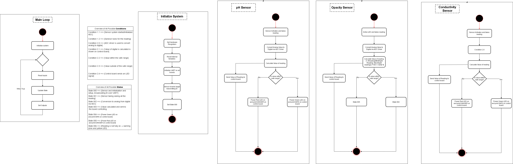

## Introduction
Our team utilizes a hub-and-spoke control/communication method for our project's software, with one subsystem (user input) acting as a motherboard to connect the other 3 sensor boards. The sensor boards can be arbitrarily attached to any of the 4 available headers, and can be removed or re-attached during operation.
The software proposal UML diagrams below are split into two sections, a state diagram representing the operation of the sensor boards, and an activity diagram representing the logic/operation of the controller board.
The main controller system utilizes the vector interrupt table on the PIC18F57Q43 MCU to handle concurrency and implement a fast-to-sleep design for power saving, allowing the CPU to be off when the display can remain on for idle usage. While currently not implemented, a idle shutdown feature could also be implemented utilizing interrupts. Our software design allows fast-to-sleep to be added in the future to each of the sensor boards as well in the same manner.

## Images

**Figure 1:** Sensors state diagram

**Figure 2:** Controller activity diagram

## Design Process

The design process of our software system was heavily influenced by the hardware layout of our system. We knew we needed to have simple and reliable common software for all the sensor boards to communicate with the controller board, so standardizing the sensor boards to a simple state-machine layout was our solution. 
The sensor boards needed to be have access to processed sensor data to light up the LEDs. To minimize the amount of inter-board communication and the amount of lanes required for communication, we decided to have the sensor boards perform their own analysis and processing on the data they take, sending the controller board only the value to display and a danger/safe boolean, enabling the use of a single UART lane.
To improve error handling, we decided to use a heartbeat signal from the sensor boards to inform the controller board of their functionality. As we are not implementing clock gating or any such advanced power saving features on the sensor boards, and they do not need to be aware of the other boards to function, they will not be recieving heartbeat signals, only sending out their unique signal.
On the controller side, since a higher level of concurrency is needed, we chose to use an interupt-driven design, leveraging the PIC18F's vector interrupt table for added efficiency. 
The controller board will primarily be serving to either drive the menu screen by user buttons, perform configuration of settings, or send the test start signal and display test values while actuating the speaker.
Buttons will be used as high-priority interrupts to ensure that the device is usable even if the CPU is put to sleep. A low-priority interrupt will be timer-driven for the heartbeat checks, which are only enabled during testing mode to save power.

## Requirements conformity

Our software proposal is capabable of meeting both the project and our own requirements. We are able to meet the requirements of a fast startup and calibration through parallizing our workload across the 4 PIC18F MCUs. We are able to have an easy-to-use and intuitive interface by utilizing interrupts to ensure that at no point, the user is locked out of the 4 basic buttons, minimizing the amount of menus and complication needed. The automatic probing and error handling improves ease of use as well.
Our software design also meets the requirements of the project by being compilable from the Microchip MPLAB X IDE from C, utilizing a hub-and-spoke model, and performing DAC or ADC conversion on each subsystem.