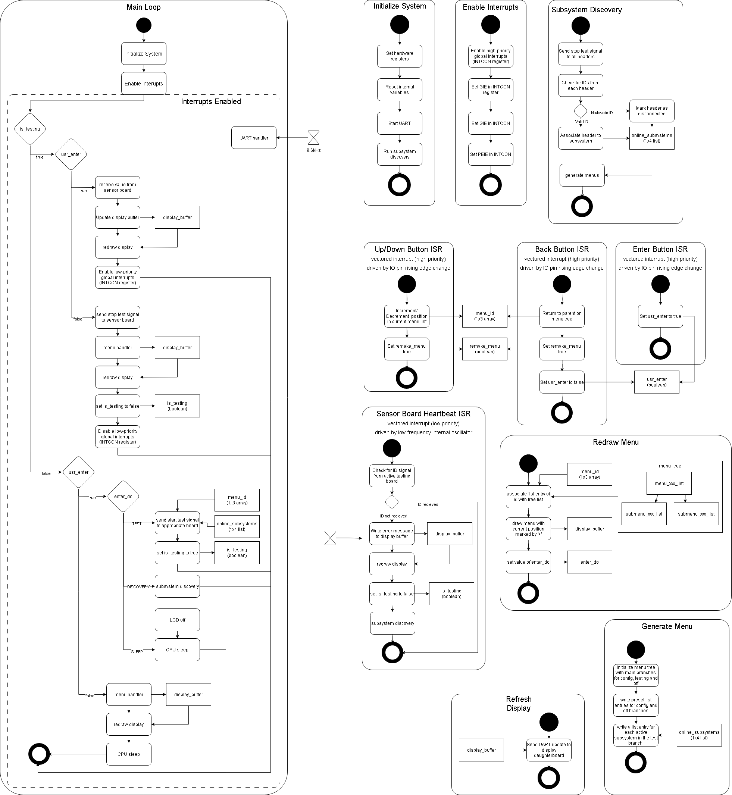

## Introduction
Our team utilizes a hub-and-spoke control/communication method for our project's software, with one subsystem (user input) acting as a motherboard to connect the other 3 sensor boards. The sensor boards can be arbitrarily attached to any of the 4 available headers, and can be removed or re-attached during operation.
The software proposal UML diagrams below are split into two sections, a state diagram representing the operation of the sensor boards, and an activity diagram representing the logic/operation of the controller board.

## Images

**Figure 1:** Sensors state diagram

**Figure 2:** Controller activity diagram

## References

